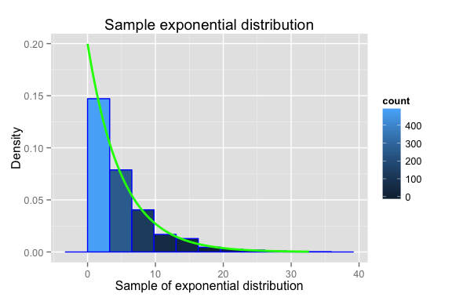
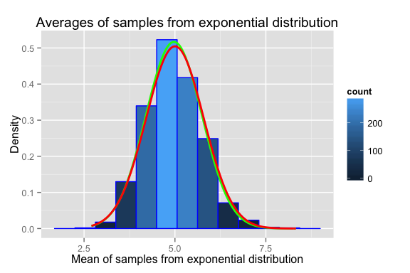
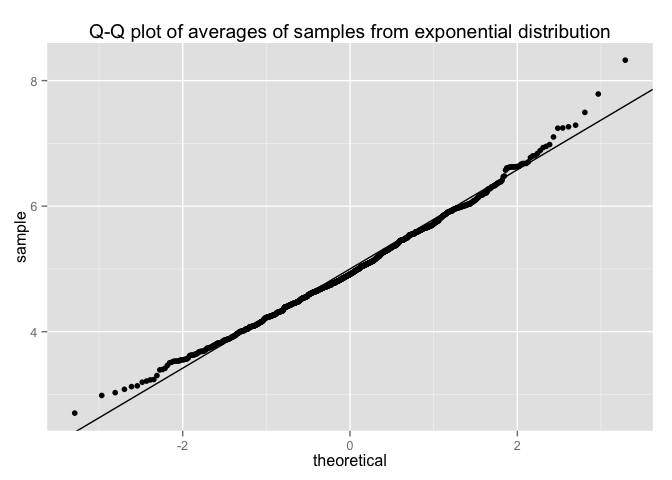

# Statistical Inference course project - simulation exercise
Evgeniy Zabrodskiy  


## Overview
This is the first part of the project for the statistical inference class. It is aimed at exploring inference and doing some simple inferential data analysis using simulated data. We'll investigate the exponential distribution and compare it with the Central Limit Theorem.

## Simulations 

The exponential distribution can be simulated in R with `rexp(n, lambda)` where lambda is the rate parameter. The mean of exponential distribution is 1/lambda and the standard deviation is also 1/lambda.  

Next piece of code defines the variables used for simulation and performs the simulation: 


```r
# rate parameter for exponential distribution
lambda <- 0.2
# sample size from exponential distribution for calculation of averages
n <- 40
# number of simulations (number of averages)
nsim <- 1000
# sample size for exponential distribution
ssize <- 1000
```

We perform 1000 simulations for which we calculate the average of 40 random generated numbers from exponential distribution with lambda = 0.2.


```r
# initializing variable for averages of samples from exponential distribution
simulated <- NULL

set.seed(12345)

for(i in 1:nsim) 
    simulated <- c(simulated, mean(rexp(n, lambda)))
```

## Simulation results
### 1. Sample Mean versus Theoretical Mean

```r
# common parameter for histograms - number of bins
nbins = 10
# range is needed to calculate the width of the bin of a histogram
simulated.range <- max(simulated) - min(simulated)

# theoretical mean is the same both for the original exponential distribution
# and for simulated distribution of averages.
theory.mean <- 1/lambda
# calculate the smaple mean of the simulated distribution of averages
simulated.mean <- mean(simulated)

ggplot(data = NULL, aes(simulated)) + 
    geom_histogram(binwidth = simulated.range/nbins, 
                   col = "blue", 
                   aes(y = ..density.., 
                       fill=..count..)) + 
    # sample mean will be shown as a vertical green line on the histogram.
    geom_vline(aes(xintercept = simulated.mean), 
               color = "green", 
               size = 1) +
    # theoretical mean will be shown as a vertical red line on the histogram.
    geom_vline(aes(xintercept = theory.mean), 
               color = "red", 
               size = 1) +
    labs(title = "Histogram of averages of samples from exponential distribution", 
         x = "Mean of samples from exponential distribution", 
         y = "Density")
```

 

Theoretical mean of the simultated distribution of averages of 40 numbers from exponential distribution is the same as the mean of the original exponential distribution: 1/lambda. 

**Theoretical mean = 5**  
**Sample mean = 4.971972**  

From the simulation we can see that the sample mean is almost identical to the theoretical mean.
On the histogram there are green and red vertical lines which represent the sample mean and the theoretical mean accordingly.

### 2. Sample Variance versus Theoretical Variance

```r
# theoretical value of the standard deviation of the sample distribution of 
# averages is 1/lambda * 1/sqrt(n)
theory.sd <- 1/lambda * 1/sqrt(n)
theory.var <- theory.sd^2

# standard deviation and variance of the simulated distribution of averages
simulated.sd = sd(simulated)
simulated.var = simulated.sd^2
```

**Theoretical variance = 0.625**  
**Sample variance = 0.5954369**  

The sample variance of the simulated distribution of averages can be used to get the approximation of the variance of the original exponential distribution: $Var_{exp} = Var_{sim}*n$ = 0.5954369 * 40 = 23.8174762 which is close to theoretical value $\frac{1}{\lambda^{2}}$ = 25

### 3. Distribution
In this section we'll compare the original exponential distribution with the distribution of averages that we simulated before.  
Here is the histogram representing an exponential distribution with the density line.

```r
expsample <- rexp(ssize, lambda)

expsample.range <- max(expsample) - min(expsample)

ggplot(data = NULL, aes(expsample)) + 
    geom_histogram(binwidth = expsample.range/nbins, col = "blue", aes(y = ..density.., fill=..count..)) + 
    # draw density line of theoretical exponential distribution with lambda
    stat_function(fun = dexp, 
                  color = "green", 
                  size = 1, 
                  args = list(rate = lambda)) +
    labs(title = "Histogram of exponential distribution", 
         x = "Sample of exponential distribution", 
         y = "Density")
```

 

Below is the histogram of the same distribution of averages that was simulated before and used in previous sections but this time density lines of the normal distribution are added.  

```r
ggplot(data = NULL, aes(simulated)) + 
    geom_histogram(binwidth = simulated.range/nbins, 
                   col = "blue", 
                   aes(y = ..density.., 
                       fill = ..count..)) + 
    # draw a normal distribution curve using theoretical mean and sd.
    stat_function(fun = dnorm, 
                  color = "green", 
                  size = 1, 
                  args = list(mean = simulated.mean, 
                              sd = simulated.sd)) +
    # draw a normal distribution curve using calculated mean and sd.
    stat_function(fun = dnorm, 
                  color = "red", 
                  size = 1, 
                  args = list(mean = theory.mean, 
                              sd = theory.sd)) +
    labs(title = "Histogram of averages of samples from exponential distribution", 
         x = "Mean of samples from exponential distribution", 
         y = "Density")
```

 

Green line is drawn using theoretical mean and standard deviation. Red line is drawn using mean and standard deviation values calculated on the actual simulated data. These curves are the visual evidence that the simulated collection of averages has normal distribution.  

There is another way to show that the distribution is normal using a Q-Q plot. Here is how it looks like:

```r
# Q-Q plot to confirm data normality
qplot(sample = simulated) + 
    geom_abline(intercept = theory.mean, slope = theory.sd) + 
    labs(title = "Q-Q plot of averages of samples from exponential distribution")
```

 

All the points lie very close to the line which is drawn using theoretical mean and standard deviation of the distribution of averages. This plot also confirms that the simulated distribution of averages is normal.
