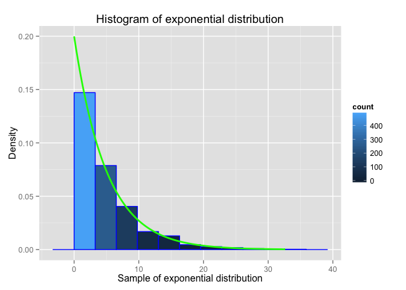
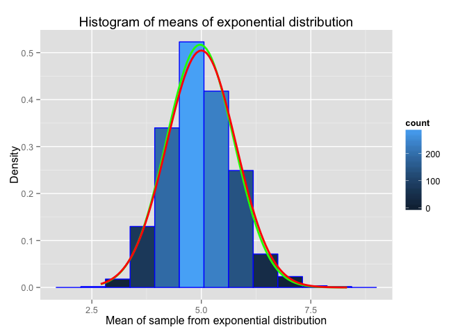

# Statistical Inference course project - simulation exercise
Evgeniy Zabrodskiy  


## Overview
This is the first part of the project for the statistical inference class. It is aimed at exploring inference and doing some simple inferential data analysis using simulated data. We'll investigate the exponential distribution and compare it with the Central Limit Theorem.

## Simulations 

```r
# The exponential distribution can be simulated in R with rexp(n, lambda) 
# where lambda is the rate parameter. The mean of exponential distribution 
# is 1/lambda and the standard deviation is also 1/lambda. Set lambda = 0.2 
# for all of the simulations. You will investigate the distribution of averages 
# of 40 exponentials. Note that you will need to do a thousand simulations.

# rate parameter for exponential distribution
lambda <- 0.2
# sample size from exponential distribution for average calculation
n <- 40
# number of simulations
nsim <- 1000
# initializing variable with averages of samples from exponential distribution
expmeans <- NULL

# sample size for exponential distribution
ssize <- 1000

# comon parameter for histograms - number of bins
nbins = 10

set.seed(12345)

for(i in 1:nsim) 
    expmeans <- c(expmeans, mean(rexp(n, lambda)))
```

Illustrate via simulation and associated explanatory text the properties of the distribution of the mean of 40 exponentials.

## 1. Sample Mean versus Theoretical Mean

```r
expmeans.range <- max(expmeans) - min(expmeans)

exptheory.mean <- 1/lambda
expmeans.mean <- mean(expmeans)

ggplot(data = NULL, aes(expmeans)) + 
    geom_histogram(binwidth = expmeans.range/nbins, 
                   col = "blue", 
                   aes(y = ..density.., 
                       fill=..count..)) + 
    # sample mean will be shown as a vertical green line on the histogram.
    geom_vline(aes(xintercept = expmeans.mean), 
               color = "green", 
               size = 1) +
    # theoretical mean will be shown as a vertical red line on the histogram.
    geom_vline(aes(xintercept = exptheory.mean), 
               color = "red", 
               size = 1) +
    labs(title = "Histogram of means of exponential distribution", 
         x = "Mean of sample from exponential distribution", 
         y = "Density")
```

 

Sample mean = 4.971972  
Theoretical mean = 5  

## 2. Sample Variance versus Theoretical Variance


```r
# theoretical value of the standard deviation of the exponential distribution 
# is 1/lambda
exptheory.sd <- 1/lambda
exptheory.var <- exptheory.sd^2

# standard deviation approximation of the exponential distribution calculated 
# from the distribution of averages is the standard diviation of the
# distribution of samples averages multiplied by sqrt(n)
expmeans.sd = sd(expmeans) * sqrt(n)
expmeans.var = expmeans.sd^2
```

Sample variance = 23.8174762  
Theoretical variance = 25  

## 3. Distribution


```r
expsample <- rexp(ssize, lambda)

expsample.range <- max(expsample) - min(expsample)

ggplot(data = NULL, aes(expsample)) + 
    geom_histogram(binwidth = expsample.range/nbins, col = "blue", aes(y = ..density.., fill=..count..)) + 
    # draw density line of theoretical exponential distribution with lambda
    stat_function(fun = dexp, 
                  color = "green", 
                  size = 1, 
                  args = list(rate = lambda)) +
    labs(title = "Histogram of exponential distribution", 
         x = "Sample of exponential distribution", 
         y = "Density")
```

 

```r
normtheory.sd <- exptheory.sd/sqrt(n) # standard diviation for normal distribution of sample means 
normtheory.mean <- exptheory.mean # mean for normal distribution of sample means

normmeans.sd <- expmeans.sd/sqrt(n) # standard diviation for normal distribution of sample means 
normmeans.mean <- expmeans.mean # mean for normal distribution of sample means

ggplot(data = NULL, aes(expmeans)) + 
    geom_histogram(binwidth = expmeans.range/nbins, 
                   col = "blue", 
                   aes(y = ..density.., 
                       fill = ..count..)) + 
    # draw a normal distribution curve using theoretical mean and sd.
    stat_function(fun = dnorm, 
                  color = "green", 
                  size = 1, 
                  args = list(mean = normmeans.mean, 
                              sd = normmeans.sd)) +
    # draw a normal distribution curve using calculated mean and sd.
    stat_function(fun = dnorm, 
                  color = "red", 
                  size = 1, 
                  args = list(mean = normtheory.mean, 
                              sd = normtheory.sd)) +
    labs(title = "Histogram of means of exponential distribution", 
         x = "Mean of sample from exponential distribution", 
         y = "Density")
```

 

